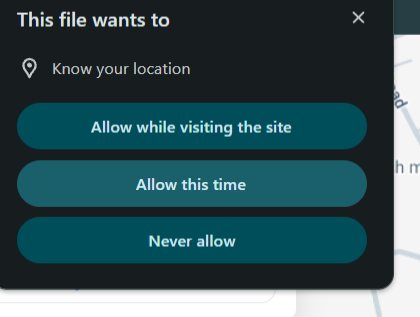
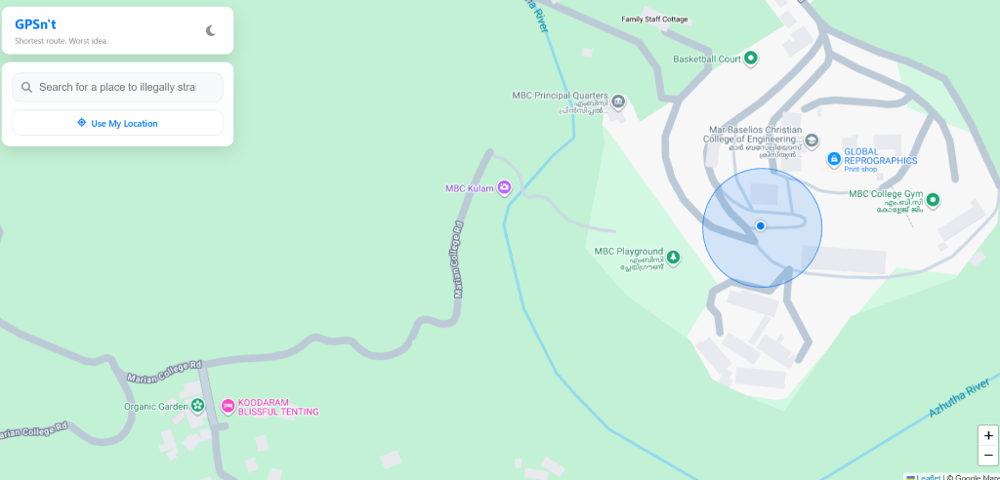
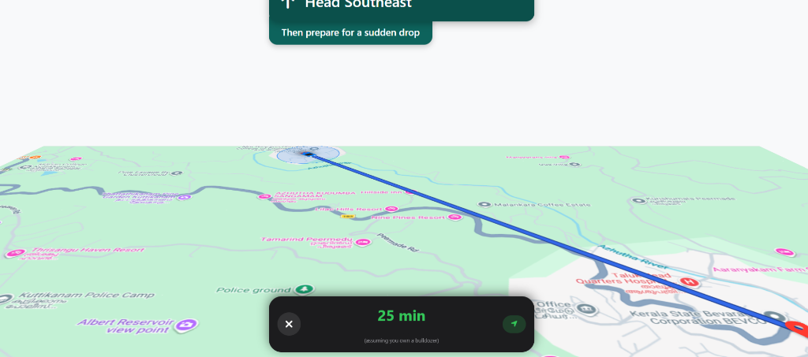

# GPSn't 🎯

## Basic Details
### Team Name: Error 404 Road Not Found

### Team Members
- Team Lead: Aron K Binu - [Your College Name Here]

### Project Description
GPSn't is the world's most aggressively unhelpful navigation app. Instead of finding the fastest route along roads, it calculates the absolute shortest path between you and your destination—a perfectly straight line that completely ignores buildings, lakes, mountains, and the laws of physics.

### The Problem (that doesn't exist)
Conventional GPS apps restrict you to roads, highways, and legal thoroughfares. What if you are in a massive hurry and simply want to drive in a straight line through your neighbor's living room and across a lake?

### The Solution (that nobody asked for)
GPSn't uses real geolocation and geocoding to draw a glowing neon-red line directly from your current position to your destination. It features a full 3D rotatable camera, a dark-mode UI that mimics real navigation apps, and provides terrible driving instructions like "Then scale the fence ahead" or "Then deploy wings."

## Technical Details
### Technologies/Components Used
For Software:
- HTML, CSS, Vanilla JavaScript
- Leaflet.js (for map rendering and 3D transformations)
- Google Maps Tile API (for high-resolution satellite imagery)
- OpenStreetMap Nominatim API (for Geocoding/Search)

### Implementation
For Software:
# Installation
No dependencies or build steps required. Just clone the repo and run a local web server to bypass browser Geolocation security restrictions!

```bash
git clone https://github.com/AronKBinu/gpsnt.git
cd gpsnt
```

# Run
If you are on Windows, simply double-click the included launcher:
```bash
Start_GPSnt.bat
```
*(This automatically runs `python -m http.server 8123` and opens your browser to `http://127.0.0.1:8123`)*

### Project Documentation
For Software:

# Screenshots

*The dark-mode UI with the glowing red route line ignoring all roads.*


*3D mode activated, showing the custom car marker pointing directly towards the destination.*


*Terrible navigation advice like "Then prepare for a sudden drop" in the top banner.*
